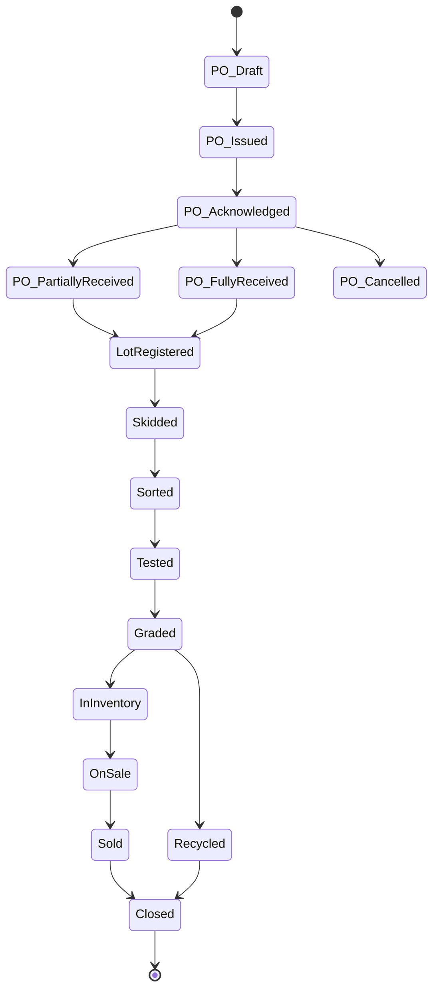
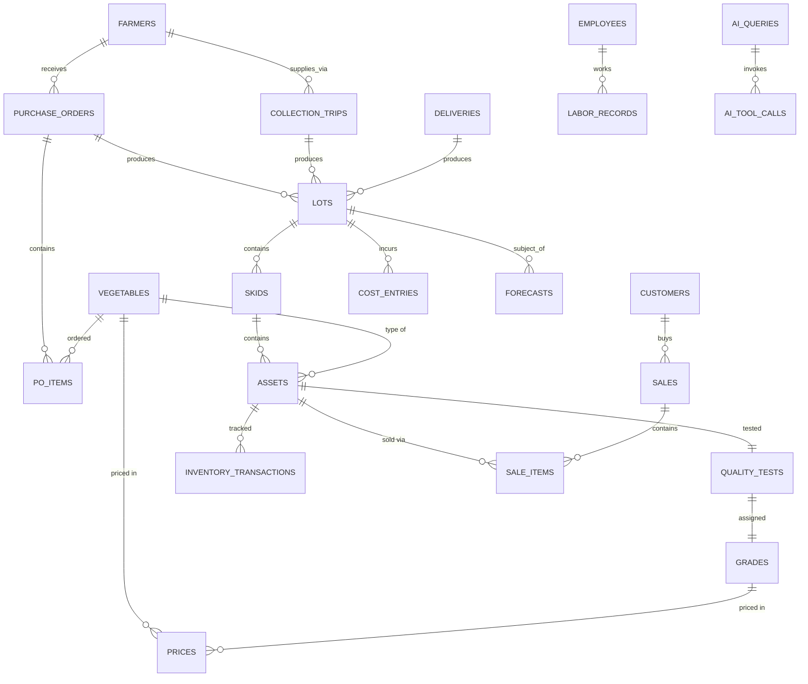
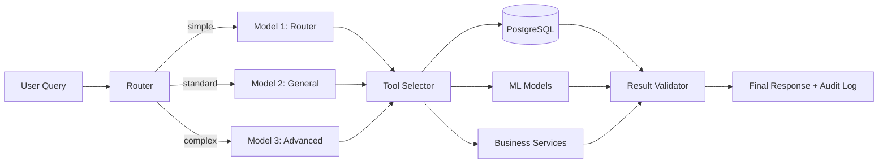
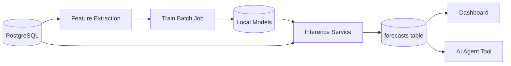

# VeggieOps AI — System Architecture

> **Status**: Milestone 1 (Documentation)
> **Last updated**: 2024
> **Owner**: VeggieOps AI Contributors

This document describes the technical architecture of VeggieOps AI. For the project overview, see [README.md](./README.md). For specific decisions and their rationale, see the [Architecture Decision Records](./docs/adr/).

---

## 1. Business Context

Vegetable resale businesses acquire produce in large lots from farmers, process them through sorting and grading, and resell to customers. The owners typically **cannot compute the true profit per lot** because costs are scattered across:

- Farm collection trips (fuel, vehicle wear, driver labor)
- Farmer deliveries (when the farmer brings produce to the shop)
- Sorting and grading labor
- Packaging, storage, and electricity
- Spoilage and recycling losses
- Selling labor and delivery

VeggieOps AI solves this by tracking every cost and revenue event against the specific lot that incurred it, then computing true profitability per lot, per farmer, per vegetable, and per grade.

---

## 2. System Overview

### 2.1 High-Level Architecture

```
┌──────────────────────────────────────────────────────────────────┐
│ PRESENTATION LAYER                                               │
│   Next.js Dashboard (React, TypeScript, Tailwind, Recharts)      │
└───────────────────────────────┬──────────────────────────────────┘
                                │ HTTPS / JSON
┌───────────────────────────────▼──────────────────────────────────┐
│ API LAYER (FastAPI)                                              │
│   /lots  /inventory  /sales  /costs  /forecast  /agent          │
└───────────────────────────────┬──────────────────────────────────┘
                                │
        ┌───────────────────────┼──────────────────────┐
        │                       │                      │
┌───────▼─────────┐  ┌──────────▼────────┐  ┌──────────▼────────┐
│ BUSINESS LOGIC  │  │  AI AGENT LAYER   │  │  ML / FORECAST   │
│ (Services)      │  │  3-Model Router   │  │  scikit-learn /   │
│ Cost Engine     │  │  + Tools          │  │  Prophet          │
│ Inventory Svc   │  │  (Ollama)         │  │                   │
│ Pricing Svc     │  │                   │  │                   │
└───────┬─────────┘  └─────────┬─────────┘  └─────────┬─────────┘
        │                      │                      │
        └──────────────────────┼──────────────────────┘
                               │
┌──────────────────────────────▼──────────────────────────────────┐
│ DATA LAYER                                                       │
│   PostgreSQL (Docker container)                                  │
│   Local filesystem (datasets, model artifacts)                   │
└──────────────────────────────────────────────────────────────────┘
```

### 2.2 Component Responsibilities

| Component | Responsibility | Does NOT do |
|---|---|---|
| **Frontend (Next.js)** | Dashboard, AI chat interface, forms | Direct DB access, AI inference |
| **Backend API (FastAPI)** | Request validation, auth, routing | UI rendering, model training |
| **Business Services** | Cost calculation, inventory math, pricing logic | LLM calls, ML predictions |
| **AI Agent** | Natural language understanding, tool selection, response generation | Arithmetic on money, raw DB queries |
| **ML Service** | Forecasting, anomaly detection | Real-time UI, business rules |
| **PostgreSQL** | Persistent storage, transactional integrity | Embeddings, large blobs |
| **Ollama** | Local LLM inference | Training, fine-tuning (initially) |

---

## 3. The Lot Lifecycle

Every lot moves through explicit stages. The system records transitions in the `processing_events` table for full auditability.



### Stage Definitions

| Stage | What Happens | Data Recorded |
|---|---|---|
| **Purchase Order Draft** | Owner decides what to order | `purchase_orders`, `po_items` |
| **PO Issued** | Order sent to farmer | `purchase_orders.status = Issued` |
| **PO Acknowledged** | Farmer confirms | `purchase_orders.status = Acknowledged` |
| **Partially Received** | First delivery arrives | `lots`, partial qty updates |
| **Fully Received** | All expected qty delivered | `purchase_orders.status = FullyReceived` |
| **Lot Registered** | Lot code assigned | `lots` row created |
| **Skidded** | Put on pallets | `skids` rows created |
| **Sorted** | Damaged separated | `sort_results` |
| **Tested** | Quality measured | `quality_tests` |
| **Graded** | Grade assigned | `quality_tests.grade_id` |
| **In Inventory** | Stocked | `inventory` + `inventory_transactions` |
| **On Sale** | Priced | `prices` applied |
| **Sold** | Customer purchase | `sales` + `sale_items` |
| **Closed** | Lot fully resolved | P&L locked |

---

## 4. Data Model

### 4.1 Entity Relationship Diagram



### 4.2 Core Tables

| Table | Purpose | Key Fields |
|---|---|---|
| `farmers` | Farmer master data | id, name, contact, location, payment_terms |
| `purchase_orders` | Procurement commitments | id, po_number, farmer_id, status, total_expected_value |
| `po_items` | Order line items | id, po_id, vegetable_id, expected_quantity_kg, expected_unit_price |
| `collection_trips` | Trips to farms | id, employee_id, vehicle, departed, returned, fuel_cost |
| `deliveries` | Farmer deliveries | id, farmer_id, arrived_at, vehicle |
| `lots` | Central entity | id, lot_code, purchase_order_id, vegetable_id, total_weight_kg, acquisition_cost, status |
| `skids` | Pallets | id, lot_id, skid_code, weight_kg |
| `assets` | Individual items (when tracked) | id, lot_id, asset_code, current_stage |
| `vegetables` | Vegetable catalog | id, name, category, default_unit_type |
| `grades` | Quality grades (seeded) | id, code (A, A-, B, B-, C, C-, RECYCLE), rank |
| `quality_tests` | Inspection records | id, asset_id, tester_id, grade_id, parameters_json |
| `inventory` | Current stock | id, asset_id, quantity_kg, quantity_units |
| `inventory_transactions` | Stock movements | id, inventory_id, txn_type, qty_change |
| `sales` | Sales header | id, customer_id, sold_at, total_amount |
| `sale_items` | Sales lines | id, sale_id, inventory_id, qty, unit_type, unit_price |
| `prices` | Price book | id, vegetable_id, grade_id, unit_type, unit_price |
| `customers` | Buyers | id, name, type |
| `employees` | Staff | id, name, role |
| `labor_records` | Time and cost | id, employee_id, activity_type, hours, rate, total_cost |
| `cost_entries` | Cost bucket | id, lot_id, cost_category, amount, allocation_method |
| `forecasts` | Predictions | id, target_type, predicted, lower, upper, model_name |
| `ai_queries` | AI usage log | id, query, model_used, tokens, cost_estimate, latency_ms |
| `ai_tool_calls` | Tool invocations | id, ai_query_id, tool_name, args, result, success |

Full field definitions with types and constraints are maintained in `database/migrations/` once Milestone 3 is complete.

---

## 5. AI Agent Architecture

### 5.1 Three-Model Strategy

| Role | Model | Parameters | VRAM (Q4) | Job |
|---|---|---|---|---|
| Model 1 (Router) | `qwen2.5-coder:1.5b` | 1.5B | ~1.5 GB | Intent classification, structured extraction |
| Model 2 (General) | `gemma3:4b` | 4B | ~3.3 GB | Business reasoning, explanations |
| Model 3 (Advanced) | `qwen2.5:7b` | 7B | ~4.7 GB | Complex multi-step analysis, anomaly investigation |

### 5.2 Agent Flow



### 5.3 Critical Safety Rules

1. **The LLM never computes money values.** All financial math is done by tested Python services that the agent calls as tools.
2. **The agent never writes/deletes business data without explicit confirmation.** Read-only queries are always allowed.
3. **Tool calls have JSON schemas.** The agent cannot invoke a tool with invalid arguments.
4. **All AI queries are logged** in `ai_queries` and `ai_tool_calls` for audit, debugging, and cost tracking.
5. **The router uses deterministic heuristics first**, then Model 1, before escalating. This keeps 80%+ of traffic on cheap models.

---

## 6. Cost and Profit Calculation

### 6.1 Cost Categories

```
Total Lot Cost = Acquisition Cost
               + Transportation Cost
               + Processing Cost
               + Storage Cost
               + Selling Cost
               + Waste/Recycle Cost
```

| Category | Examples | Allocation Method |
|---|---|---|
| Acquisition | Purchase price, farmer payment | Fixed per lot |
| Transportation | Fuel, vehicle wear, driver time | Weight or fixed per lot |
| Processing | Sorting labor, grading labor, equipment | Weight, count, or time |
| Storage | Cold room electricity, days stored | Weight × days |
| Selling | Shop labor, packaging, delivery | Per sale |
| Waste | Disposal, lost value | Fixed per recycled item |

### 6.2 Allocation Strategies

The system supports five allocation methods, configurable per cost type:

| Method | Use Case |
|---|---|
| Fixed per lot | Trip costs that don't scale with quantity |
| Weight-based | Storage costs that scale with mass |
| Count-based | Grading labor that scales with item count |
| Time-based | Sorting costs that scale with processing duration |
| Volume-based | Transport costs that scale with cubic space |

### 6.3 Profitability Formulas

```
Revenue         = SUM(sale_items.line_total)
GrossProfit     = Revenue - TotalLotCost
AllocatedOverhead = (lot_weight / total_shop_weight) × MonthlyOverhead
NetProfit       = GrossProfit - AllocatedOverhead
ProfitMargin    = (NetProfit / Revenue) × 100
CostPerKG       = TotalLotCost / total_sold_kg
ProfitPerKG     = NetProfit / total_sold_kg
WastePercentage = (recycled_kg / total_lot_kg) × 100
```

---

## 7. Predictive Analytics

### 7.1 Forecasting Ladder

We start simple and justify complexity:

| Level | Model | Use Case |
|---|---|---|
| L0 | Last value / mean | Baseline sanity check |
| L1 | Moving average (7d, 30d) | Short-term demand |
| L2 | Linear regression | Demand vs price, season |
| L3 | Random Forest / Gradient Boosting | Sales classification, anomalies |
| L4 | Prophet / ARIMA | Forecasting with seasonality |
| L5 | LSTM / Transformer | Only if L4 underperforms |

### 7.2 What We Forecast

| Target | Initial Model | Output |
|---|---|---|
| Daily sales (kg) per vegetable | Moving avg + linear regression | Point + 80% interval |
| Weekly revenue | Linear regression | Point + interval |
| Profit per lot (pre-arrival) | Gradient Boosting | Point + interval |
| Waste percentage | Random Forest | Point |
| Days to sellout | Linear regression | Point |

### 7.3 Pipeline



Training runs as a batch job. Inference is a FastAPI endpoint that loads the latest model from disk at startup. Forecasts are stored in the database for historical comparison.

---

## 8. Local Deployment

### 8.1 Hardware Requirements

| Component | Minimum | Recommended |
|---|---|---|
| GPU | NVIDIA 8GB VRAM | RTX 3080 (10GB) or better |
| RAM | 16 GB | 32 GB |
| Storage | 50 GB free | 100 GB free (for model cache + datasets) |
| OS | Windows 10/11, Linux, macOS | Linux preferred for Docker |

### 8.2 Software Stack

| Component | Version | Purpose |
|---|---|---|
| Docker Desktop | Latest | Container runtime |
| Ollama | Latest | Local LLM server |
| Python | 3.11+ | Backend language |
| Node.js | 20+ | Frontend build |
| PostgreSQL | 15 | Database (in Docker) |
| Git | 2.40+ | Version control |

### 8.3 VRAM Budget for AI Models

```
┌────────────────────────────────────────┐
│ RTX 3080: 10 GB total VRAM             │
├────────────────────────────────────────┤
│ Model 1 (router, resident): ~1.5 GB    │
│ Model 2 OR 3 (one active): 3.3–4.7 GB │
├────────────────────────────────────────┤
│ Worst case (Model 1 + Model 3): ~6.2 GB│
└────────────────────────────────────────┘
```

Ollama uses LRU eviction to swap models automatically when VRAM is needed.

---

## 9. Security

| Concern | Mitigation |
|---|---|
| Secrets in code | `.env` files, gitignored; never committed |
| SQL injection | SQLAlchemy parameterized queries only |
| Input validation | Pydantic schemas on every API endpoint |
| Authentication | Bearer tokens (JWT) — implemented in later milestone |
| Authorization | Role-based access (Owner, Employee, Auditor) |
| HTTPS | Local dev uses HTTP; production uses reverse proxy with TLS |
| Audit logs | Every AI query and tool call logged |
| Rate limiting | Implemented at API layer (later milestone) |

---

## 10. Privacy and Cost Advantage

| Benefit | How |
|---|---|
| No cloud AI bills | All inference is local via Ollama |
| No data leaves your machine | Postgres, AI models, code all on local hardware |
| No subscription fees | Open-source stack entirely |
| Full control | You own every byte of business data |

The trade-off is hardware: you need a decent GPU (8GB+ VRAM) for acceptable performance.

---

## 11. Open Decisions and Future Work

These are intentionally deferred:

- Multi-location support (currently single shop)
- Multi-currency (currently USD only)
- Mobile app (currently web dashboard only)
- Multi-user concurrent editing (single-user assumption)
- Fine-tuned domain models (currently using general-purpose LLMs)
- Voice interface
- Supplier portal for direct PO submission

Each will be evaluated when relevant.

---

## 12. References

- [README.md](./README.md) — Project overview
- [docs/adr/](./docs/adr/) — Architecture Decision Records
- [docs/glossary.md](./docs/glossary.md) — Domain terminology
- [docs/roadmap.md](./docs/roadmap.md) — Implementation milestones
